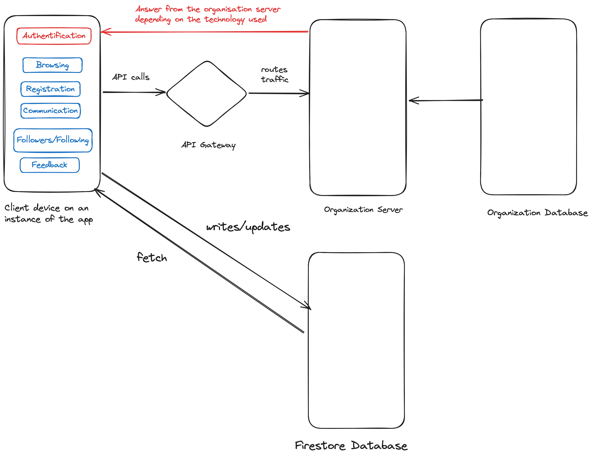

# Functional Requirements

*Max 3 pages.*

*List the key features of the MVP precisely.*

*Include appropriate architectural diagrams.*

*Describe key internal functionality.*

In the GatherSpot MVP, we decided to support self-hosting of data by different entities. The idea is to enable institutions to have their own instance of the GatherSpot app, hosted on their servers.Large organizations may require high levels of data security and control. Self-hosting ensures that sensitive information is stored within the organization’s own infrastructure, minimizing the risk of external data breaches.

In the POC, the only way to store data was on Firebase. We need to adapt and extend the app so that an organization can choose where it saves its data. The outcome should stay as simple as possible so that the organization will use GatherSpot.

The remaining features from the MVP can be implemented directly within our app without much trouble.